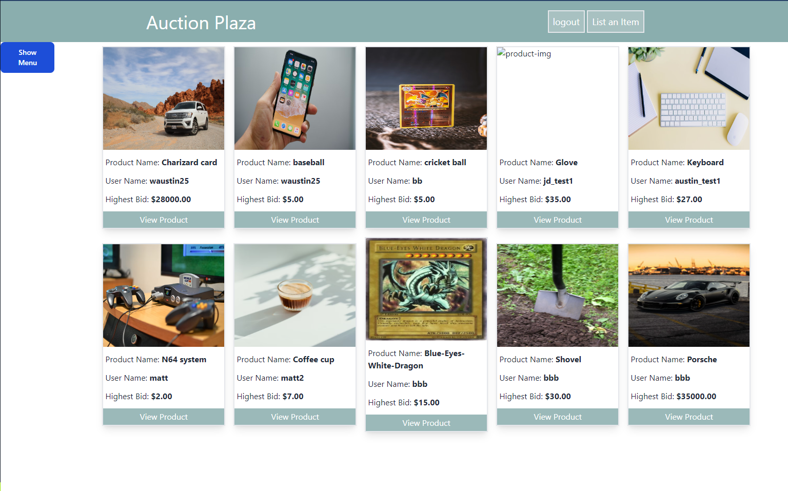

# Auction Plaza

## Description
A auction site were users can post and bid on products as well as sort through various products using the various filters to find exactly what their looking for in the shortest amount of time possible.

## User story
```
AS A USER of the website, I want a personal account where I can list my products as well as manage my bidding for other products, such that:
WHEN I access the homepage,
THEN I am presented with a link to a login page.
WHEN I go to the login page,
THEN I am presented with options to either create a new account or login to an existing account.
WHEN I create a new account,
THEN my user information is saved with sensitive data encrypted.
WHEN I login to my existing account,
THEN I can view my account data.
```

### Seller Side
```
AS A SELLER I want a website where I can sell my products for the best price possible such that:
WHEN I access a page to list a product for sale, 
THEN I am presented with a page to create my product. 
WHEN I fill in the product information and click submit,
THEN my product is viewable on the homepage.

```
### Buyer Side
```
AS A BUYER I want to be able to bid on items and be able to get them for the best price possible, such that:
WHEN I go to the homepage,
THEN I can see all the products available for sale.
WHEN I open the side menu,
THEN I can see a variety of ways to sort the items.
WHEN I click on a specific product,
THEN I can view the information about it, including bidding history, and place a bid on it myself.
WHEN I place a bid,
THEN my bid is recorded and displayed on the product page.
```

## Team
- Matt: https://github.com/codex-scribe
- Jonathan: https://github.com/PlutiePatootie
- Austin: https://github.com/waustin45

## Links
- Repo: https://github.com/waustin45/auction-site.git
- Live site: https://auction-site-gt.herokuapp.com/

## Preview

